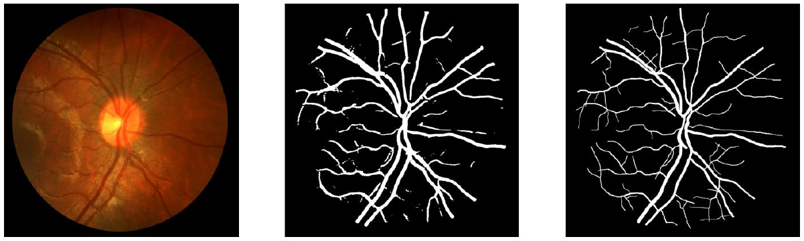

# retinal-vessels-detector
This application uses deep neural network and image processing to detect blood vessels in retinal images.

## Table of contents
* [General info](#general-info)
* [Technologies](#technologies)
* [Setup](#setup)
* [Input](#input)
* [Output](#output)

## General info
U-Net is a convolutional neural network that was developed for biomedical image segmentation. 

Results on validation set:
val_loss: 0.1000
val_accuracy: **0.9635**

The project was made in **April 2021**.

## Technologies
* Python 3
* TensorFlow
* Keras
* opencv

## Setup
It`s preferred to open in PyCharm 

Clone this repository using git bash:
```
https://github.com/bartosztkowalski/retinal-vessels-detector.git
```
Image processing is located in ```imageProcessing.py``` and deep neural network in ```UNetProcessing.py```. Execute these files to run algorithms.

## Input 
Retinal image (.png) and it`s binary mask (.png), the closer 1024x1024 the better. For example:


## Output
Image processing result:
[input-img | output | input-mask]
